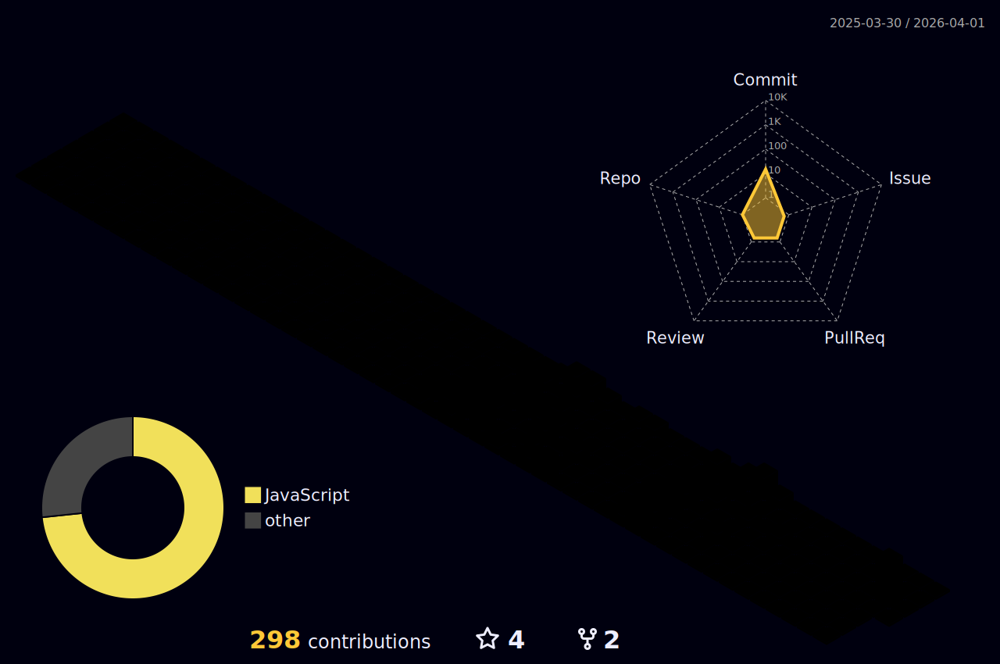

<h3 align="left">Tech Stack:</h3>

  
  
  
  

<!--

  
  
  
  
  
  
  
  
  
  
  
  
  
  
  
  
  
  
  
  
  
  
  
  
  
  
  
  
  
  
  
  
  
  
  
  
  
  
  
  
  

-->

<h3 align="left">Activity:</h3>

  
   

<!--

  

-->

<h2> My contributions</h2>

 

   

<!---   
   
  
-->

   

<h3 align="left">Connect with me:</h3>

