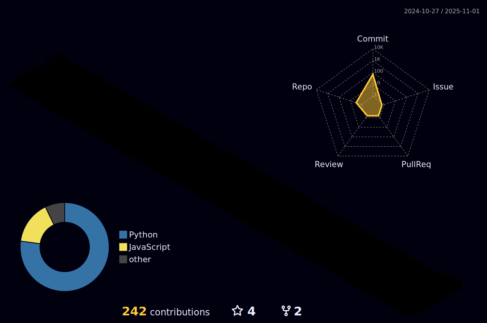

<h1 align="center">Hi, Im Samith</h1>
<h3 align="center">Software Engineer</h3>

<h3 align="left">Languages:</h3>

    

<h3 align="left">Connect with me:</h3>

    

  

<h3 align="left">LeetCode:</h3>

  
  

<!--
 -->

<h2> My contributions</h2>
  
 

  
Holopin

   
   
  

   

